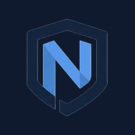

<p align="center"></p>

<h1 align="center">Norypt Protect</h1>

<p align="center">
  <a href="https://github.com/norypt-prv/norypt-protect/actions/workflows/build.yml">
    
  </a>
  <a href="LICENSE">
    
  </a>
  <a href="https://f-droid.org/packages/com.norypt.protect">
    
  </a>
</p>

<p align="center">
  Local-only Android security: lock, wipe, harden. No network. No logs. No cloud.
</p>

---

## Overview

Norypt Protect combines panic triggers (5× power button, dead-man switch, low-battery wipe) with device hardening (Device Admin / Device Owner, work-profile wipe, Emergency SOS disable) and Norypt-specific features in a single GPL-licensed app that **never connects to the internet** — the `INTERNET` permission is not declared.

It is designed for users who face physical seizure of their device and need last-resort data destruction without depending on any remote server.

---

## Features

### Panic Triggers
- **5× power-button press** — instant screen lock or full device wipe
- **Dead-man switch** — wipe if device is not checked in within a configurable interval
- **Low-battery dead-man** — wipe when battery drops below threshold and device is unchecked
- **Notification listener monitor** — detect and respond to suspicious notifications
- **App-internet permission monitor** — alert when apps gain unexpected network access

### Device Hardening
- **Device Admin** — lock screen enforcement without ADB
- **Device Owner** (ADB) — unlocks full feature set
- **Work-profile-only wipe** — destroys work profile while preserving personal data
- **Auto-disable Emergency SOS** — disables accidental SOS calls on DO promotion
- **Hide from launcher** — toggle app icon visibility in the app drawer
- **ADB upgrade card** — in-app instructions for Device Owner escalation

### Norypt-Specific
- Full-screen wipe countdown with cancel window
- Lockdown toggle (lockdown API, Android 9+)
- Protection level screen with Device Owner-gated toggles

---

## Requirements

| Item | Value |
|------|-------|
| Android version | 13+ (API 33 minimum) |
| Target SDK | 35 |
| Network permission | None (`INTERNET` not declared) |
| License | GPL-3.0-or-later |

---

## Install

### Option 1 — F-Droid (official index)

Search for **Norypt Protect** in the [F-Droid](https://f-droid.org) client once the app is listed.

### Option 2 — Self-hosted F-Droid repo

```
https://fdroid.norypt.com/fdroid/repo?fingerprint=<SHA256>
```

Add the repo URL to the F-Droid client, then search for Norypt Protect.

### Option 3 — GitHub Releases

Download the signed APK from the [Releases](https://github.com/norypt-prv/norypt-protect/releases/latest) page and verify the SHA-256 before installing:

```bash
sha256sum norypt-protect-1.0.0.apk
# compare with the checksum published on the release page
```

### Device Admin enrollment

1. Settings → Apps → Norypt Protect → **Allow restricting settings** → ON
2. Open Norypt Protect → **Enable** → Settings → Security → Device admin apps → **Activate**

### Device Owner (full feature set)

```bash
adb shell dpm set-device-owner com.norypt.protect/.admin.NoryptDeviceAdminReceiver
```

---

## Security model

- **No network**: `INTERNET` permission is absent from the manifest.
- **No logs**: the app does not write to logcat or external storage beyond its own sandboxed prefs.
- **Reproducible builds**: every release APK is bit-for-bit reproducible inside the pinned Dockerfile. See [docs/reproducible-build.md](docs/reproducible-build.md).
- **Local state only**: all configuration is stored in Android SharedPreferences, encrypted at rest by the OS.
- **Threat model**: physical seizure — last-resort wipe when the device cannot be protected by other means.

---

## Build from source

### Quick (Docker, reproducible)

```bash
docker build -t norypt-protect-builder .
docker run --rm -v "$(pwd):/workspace" norypt-protect-builder \
  ./gradlew :app:assembleRelease
```

### Local (debug)

```bash
export JAVA_HOME=/path/to/jdk17
./gradlew :app:assembleDebug
./gradlew :app:testDebugUnitTest
```

### Release (with keystore)

Copy `keystore.properties.example` to `keystore.properties` and fill in your keystore details, then:

```bash
./gradlew :app:assembleRelease
```

---

## Verify a downloaded APK

```bash
sha256sum norypt-protect-1.0.0.apk
```

Compare the output with the SHA-256 published on the [release page](https://github.com/norypt-prv/norypt-protect/releases) and on [norypt.com/protect](https://norypt.com/protect).

---

## License

GPL-3.0-or-later. See [LICENSE](LICENSE).

---

## Contact & contributing

- **Security issues**: [norypt@proton.me](mailto:norypt@proton.me) (PGP preferred)
- **Bug reports / feature requests**: [GitHub Issues](https://github.com/norypt-prv/norypt-protect/issues)
- **Pull requests**: welcome. Keep changes focused; do not add network permissions.
